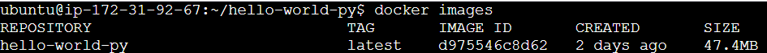

# Docker

Containerize an application Hello-world Python

Build the Image

docker build -t hello-world-py .

To Check the Image

docker images

Run the Image to make container

docker run -d -p 8080:8080 hello-world-py

To check the container is running

docker ps

Access the Application

# CI Pipeline(Azure Pipelines)

Build -> Push

https://github.com/lellaaditya/Cont-Docker-Kubernetes/blob/main/Demo/Docker/Dockerfile

https://github.com/lellaaditya/Cont-Docker-Kubernetes/blob/main/Demo/Kubernetes/azure-pipeline.yaml

Push Image to ACR

