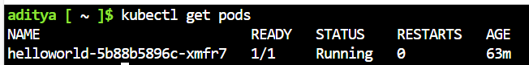
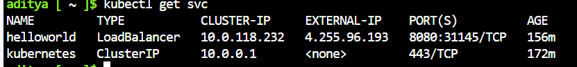
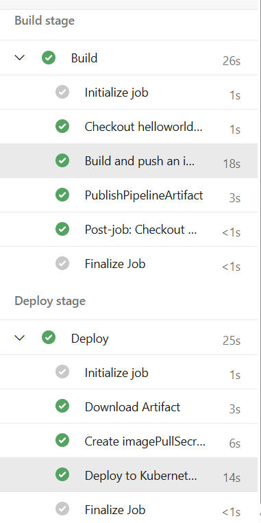
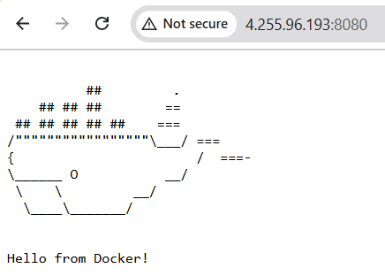

# Kubernetes
 
K8s,
- is an Container Orchestration Tool  
- is an open source system for automating deployment, scaling, and management of containerized applications
- on-premises, hybrid, or public cloud infrastructure

Cluster - A cluster is a set of nodes (physical or virtual machines) running Kubernetes agents, managed by the control plane

Pod - Pods are the smallest deployable units of computing that you can create and manage in Kubernetes.Containers runs inside the Pod

Node - physical or virtual machines

# Control plane components

kube-apiserver
- Takes all the requests from the external world.The API server is the front end for the Kubernetes control plane
- Used to manage create and config k8s external components and parts of cluster all communication to each other

etcd
- Consistent and highly-available key value store used as Kubernetes' backing store for all cluster data
kube-scheduler

kube-controller-manager
- a controller is a control loop that watches the shared state of cluster through the apiserver and makes changes attempting to move the current state towards the desired state

cloud-controller-manager
- embeds cloud-specific control logic.Node controller,Route controller,Service controller
# Node components

kubelet
- creation and manages the pod

kube-proxy
- provides networking,ip addresses,load balancing

Container runtime
- responsible for managing the execution and lifecycle of containers within the Kubernetes environment

On-Prem

kind lets you run Kubernetes on your local computer

minikube is a tool that lets you run Kubernetes locally. minikube runs an all-in-one or a multi-node local Kubernetes cluster on your personal computer (including Windows, macOS and Linux PCs) so that you can try out Kubernetes, or for daily development work

kubeadm tool to create and manage Kubernetes clusters. It performs the actions necessary to get a minimum viable, secure cluster up and running in a user friendly way - Production 

managed Kubernetes service 
- by Microsoft Azure which is Azure Kubernetes Service(AKS)
- by AWS which is EKS
- by Google which is GKE

kubectl is an Kubernetes command-line tool to run commands against Kubernetes clusters

A cluster is a set of nodes (physical or virtual machines) running Kubernetes agents, managed by the control plane. Kubernetes v1.33 supports clusters with up to 5,000 nodes. More specifically, Kubernetes is designed to accommodate configurations that meet all of the following criteria:

No more than 110 pods per node

No more than 5,000 nodes

No more than 150,000 total pods

No more than 300,000 total containers

You can scale your cluster by adding or removing nodes. The way you do this depends on how your cluster is deployed

kubectl create -f FILENAME

examples 

kubectl create -f deployment.yml

kubectl create -f service.yml

To check the Pods

Kubectl get pods

To Check the Service

Kubectl get svc

# Azure Pipelines
CI/CD Process

Build -> Push the Image ->Deploy

https://github.com/lellaaditya/Cont-Docker-Kubernetes/blob/main/Demo/Kubernetes/azure-pipeline.yaml

https://github.com/lellaaditya/Cont-Docker-Kubernetes/tree/main/Demo/Kubernetes/manifests

Access the Application with Load balancer

